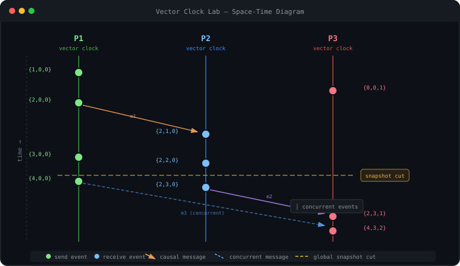
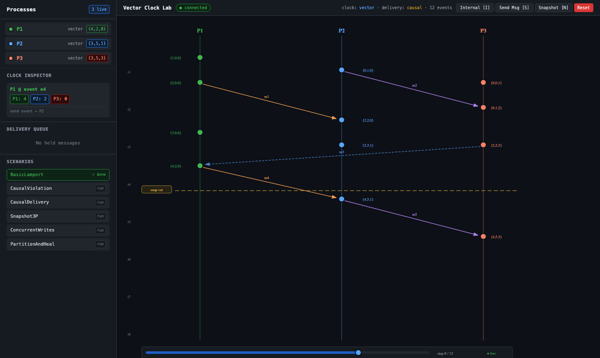
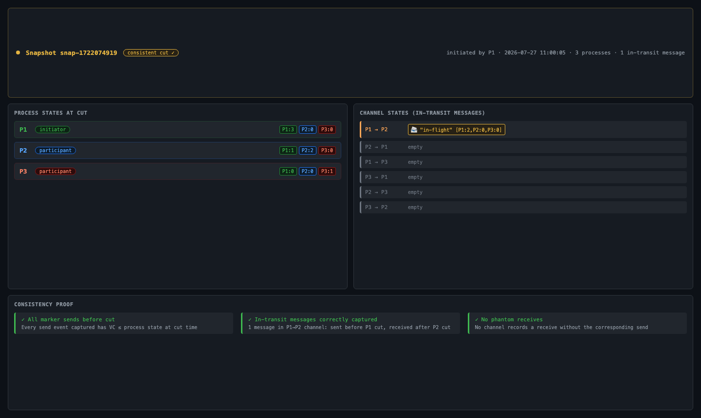
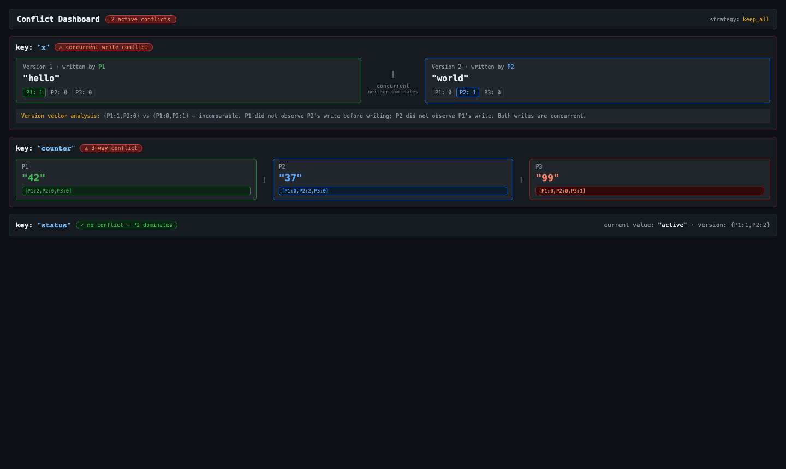
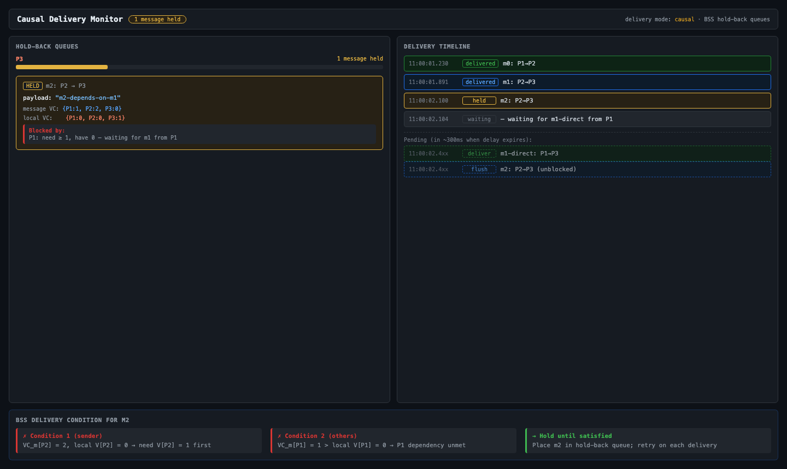
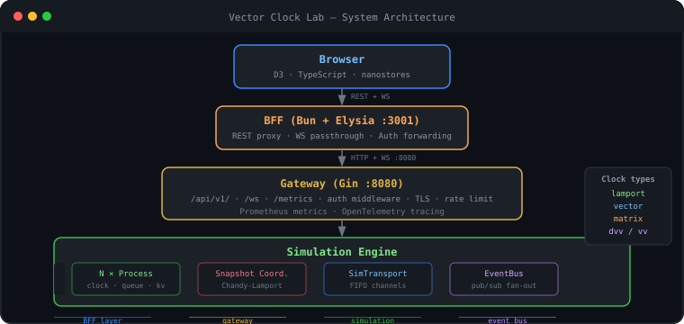

<h1 align="center">Vector Clock Lab</h1>

<p align="center">
  An interactive distributed systems laboratory — Lamport clocks, vector clocks, matrix clocks,<br/>
  causal delivery, Chandy-Lamport global snapshots, and conflict detection, all live in the browser.
</p>

<p align="center">
  <a href="https://sanskarpan.github.io/Vector-Clock/"></a>&nbsp;
  <a href="https://github.com/sanskarpan/Vector-Clock/actions/workflows/ci.yml"></a>&nbsp;
  <a href="https://github.com/sanskarpan/Vector-Clock/actions/workflows/docs.yml"></a>&nbsp;
  &nbsp;
  &nbsp;
  &nbsp;
  <a href="LICENSE"></a>
</p>

<p align="center">
  
</p>

<table align="center">
  <tr>
    <td align="center" width="50%">
      
      <br/><sub><b>Space-Time Diagram</b> — live D3, scrubber, snapshot cut</sub>
    </td>
    <td align="center" width="50%">
      
      <br/><sub><b>Snapshot Viewer</b> — consistent cut, channel states, proof</sub>
    </td>
  </tr>
  <tr>
    <td align="center" width="50%">
      
      <br/><sub><b>Conflict Dashboard</b> — concurrent writes, version vectors</sub>
    </td>
    <td align="center" width="50%">
      
      <br/><sub><b>Causal Delivery Monitor</b> — BSS hold-back queues</sub>
    </td>
  </tr>
</table>

---

## What you can explore

The lab simulates **N processes** exchanging messages over in-process FIFO channels and streams every event — clock tick, send, receive, marker — to a live D3-powered space-time diagram in the browser.

```bash
# Start the lab
docker compose up -d
open http://localhost:3001
```

- Spawn processes and watch their **Lamport, vector, or matrix clocks** tick in real time
- Send messages and observe **causal arrows** drawn across process lanes
- Inject **network faults** — delay, drop, reorder, partition — and watch the system react
- Trigger a **Chandy-Lamport global snapshot** and inspect the consistent cut with in-transit messages
- Write concurrently to the **causal KV store** and see version-vector conflict detection fire

---

## Algorithms implemented

| Concept | Paper | Module |
|---------|-------|--------|
| Scalar logical clocks | Lamport 1978 | `internal/clock/lamport` |
| Happened-before relation (→) | Lamport 1978 | `internal/causality` |
| Vector clocks | Fidge 1988 / Mattern 1989 | `internal/clock/vector` |
| Partial order detection | Charron-Bost 1991 | `internal/causality` |
| Matrix clocks (MC1–MC4) | Kshemkalyani & Singhal 1992 | `internal/clock/matrix` |
| Version vectors | Parker et al. 1983 | `internal/clock/version` |
| Dotted version vectors | Preguiça et al. 2010 | `internal/clock/dvv` |
| BSS causal broadcast | Birman-Schiper-Stephenson 1987 | `internal/process` |
| Global snapshot | Chandy-Lamport 1985 | `internal/snapshot` |
| Causal KV store | Ahamad et al. 1995 | `internal/conflict` |

---

## Architecture

<p align="center">
  
</p>

The Go backend (`gateway/` + `internal/`) runs on `:8080`. A Bun/Elysia BFF on `:3001` proxies REST and WebSocket connections. All internal events are published on an `EventBus` and fanned out to every connected browser.

```
Browser (D3 + TypeScript)
   │ HTTP + WebSocket
BFF (Bun + Elysia :3001)        ← forwards Authorization header
   │ HTTP + WebSocket :8080
Gateway (Gin)                   ← auth, metrics, TLS, rate-limit
   │
Simulation Engine               ← N processes, SimTransport, EventBus
   ├── N × Process              ← clock, hold-back queue, KV store
   ├── SnapshotCoordinator      ← Chandy-Lamport, race-free capture
   └── SimTransport             ← per-channel buffered Go channels
```

---

## Quickstart

### Docker Compose

```bash
git clone https://github.com/sanskarpan/Vector-Clock.git
cd Vector-Clock
docker compose up -d

# Verify
curl http://localhost:8080/healthz   # {"status":"ok"}
open http://localhost:3001
```

### Run directly

```bash
go run ./cmd/server                  # backend on :8080
cd frontend && bun install && bun run dev  # BFF + frontend on :3001
```

### Try it from curl

```bash
# Spawn three processes
curl -X POST :8080/api/v1/processes -d '{"id":"P1","clock_type":"vector"}'
curl -X POST :8080/api/v1/processes -d '{"id":"P2","clock_type":"vector"}'
curl -X POST :8080/api/v1/processes -d '{"id":"P3","clock_type":"vector"}'

# Send a message — watch the WebSocket stream for causal events
curl -X POST :8080/api/v1/messages -d '{"from":"P1","to":"P2","payload":"hello"}'

# Run the 3-process snapshot scenario
curl -X POST :8080/api/v1/scenarios/Snapshot3P/run

# Inject a 300ms delay on P1→P3
curl -X POST :8080/api/v1/channels/P1/P3/delay -d '{"delay_ms":300}'

# Trigger a network partition
curl -X POST :8080/api/v1/partition -d '{"side_a":["P1","P2"],"side_b":["P3"]}'
curl -X DELETE :8080/api/v1/partition   # heal
```

---

## Pre-built scenarios

Eight scenarios demonstrate key distributed systems properties — run any from the UI or:

```bash
curl -X POST :8080/api/v1/scenarios/<name>/run
```

| Scenario | Demonstrates |
|----------|-------------|
| `BasicLamport` | Lamport clocks, happened-before, concurrent events |
| `CausalViolation` | What breaks without causal delivery (`delivery_mode: immediate`) |
| `CausalDelivery` | BSS hold-back queue flushing in the right order |
| `Snapshot3P` | Chandy-Lamport markers, consistent cut, in-transit messages |
| `ConcurrentWrites` | Concurrent KV writes → version-vector conflict |
| `FalseConflict` | Version vectors distinguishing concurrent from causal writes |
| `MatrixGC` | Matrix clock MC3 rule, stable-message garbage collection frontier |
| `PartitionAndHeal` | Network partition, message loss, recovery |

---

## Frontend panels

| Panel | Shows |
|-------|-------|
| **SpaceTimeDiagram** | Live D3 space-time diagram — events, causal arrows, snapshot cut line, scrubber |
| **ClockInspector** | Per-process clock state (Lamport int / vector / N×N matrix) + hold-back queue |
| **CausalDelivery** | BSS queue depth chart, held/delivered timeline, BlockedBy analysis |
| **SnapshotViewer** | Completed snapshots — process states, in-transit channel messages |
| **ConflictDash** | KV store conflicts — version vectors side-by-side, dominance graph |
| **ScenarioPanel** | Run cards for all 8 scenarios, live indicator, history |
| **TheoryCards** | Inline collapsible reference cards for each concept |

---

## Configuration

```yaml
# config.yaml
simulation:
  initial_processes: 3
  clock_type: vector       # lamport | vector | matrix
  delivery_mode: causal    # immediate | causal
  channels: full_mesh

timing:
  message_transit_delay: 50ms
  drop_probability: 0.0

kv:
  conflict_strategy: keep_all  # lww | first_writer | merge | keep_all
```

Key environment variables:

| Variable | Purpose |
|----------|---------|
| `VC_API_TOKENS` | `name:token` pairs — enables Bearer auth |
| `VC_ALLOWED_ORIGINS` | WebSocket origin allowlist |
| `VC_TLS_CERT_FILE` / `VC_TLS_KEY_FILE` | Enable TLS |
| `VC_TLS_RELOAD_INTERVAL` | Hot-reload cert on this interval (e.g. `5m`) |
| `OTEL_EXPORTER` | `none` \| `stdout` \| `otlp` |

Full reference → [docs/configuration](https://sanskarpan.github.io/Vector-Clock/configuration/)

---

## API

The backend exposes a REST + WebSocket API:

```
GET  /healthz                        liveness
GET  /readyz                         readiness
GET  /metrics                        Prometheus text format
POST /api/v1/processes               spawn process
GET  /api/v1/processes               list all processes
DEL  /api/v1/processes/:id           kill process
POST /api/v1/messages                send message
POST /api/v1/broadcast               broadcast to all peers
POST /api/v1/scenarios/:name/run     run scenario
POST /api/v1/snapshots               initiate Chandy-Lamport snapshot
GET  /api/v1/snapshots               list snapshots
POST /api/v1/channels/:f/:t/delay    inject delay
POST /api/v1/channels/:f/:t/drop     inject drop probability
POST /api/v1/partition               create network partition
DEL  /api/v1/partition               heal partition
PUT  /api/v1/kv/:key                 write to KV store
GET  /api/v1/kv/:key                 read (all concurrent versions)
GET  /ws                             WebSocket event stream
```

Full reference → [docs/api](https://sanskarpan.github.io/Vector-Clock/api/)

---

## Testing

```bash
# Unit + integration (race detector)
make test-race

# Coverage report (fails if < 60%)
make test-coverage

# E2E against live server
VC_API_TOKENS="test:secret" go test ./test/e2e/... -v -timeout=180s

# K6 load test
k6 run test/k6/scenarios.js --env BASE_URL=http://localhost:8080

# Playwright browser tests (22 tests)
cd frontend && bunx playwright test
```

Test pyramid: unit per package → integration → E2E → K6 load/chaos → Playwright browser.
All pass with `-race`. See [docs/testing](https://sanskarpan.github.io/Vector-Clock/testing/) for the full matrix.

---

## Deployment

```bash
# Kubernetes
kubectl apply -f deploy/k8s/
kubectl rollout status deployment/vectorclock-server -n vectorclock

# Docker Compose (production)
VC_API_TOKENS="admin:$(openssl rand -hex 32)" \
VC_TLS_CERT_FILE=/certs/tls.crt \
VC_TLS_KEY_FILE=/certs/tls.key \
docker compose -f docker-compose.prod.yml up -d
```

Full guide → [docs/deployment](https://sanskarpan.github.io/Vector-Clock/deployment/)

---

## Documentation

**[sanskarpan.github.io/Vector-Clock](https://sanskarpan.github.io/Vector-Clock/)** — full site:

- [Core concepts](https://sanskarpan.github.io/Vector-Clock/concepts/) — logical time, happened-before, consistent cuts
- [Clock algorithms](https://sanskarpan.github.io/Vector-Clock/algorithms/) — Lamport, vector, matrix, DVV with Go API
- [Global snapshots](https://sanskarpan.github.io/Vector-Clock/snapshot/) — Chandy-Lamport theory + ABBA deadlock fix
- [Causal delivery](https://sanskarpan.github.io/Vector-Clock/causal-delivery/) — BSS hold-back queues
- [Conflict detection](https://sanskarpan.github.io/Vector-Clock/conflict/) — version vectors, LWW, FWW
- [Architecture](https://sanskarpan.github.io/Vector-Clock/architecture/) — package structure, concurrency model
- [API reference](https://sanskarpan.github.io/Vector-Clock/api/) — all endpoints and WS events
- [Deployment](https://sanskarpan.github.io/Vector-Clock/deployment/) — Docker, Kubernetes, TLS, Prometheus
- [Cookbook](https://sanskarpan.github.io/Vector-Clock/cookbook/) — copy-paste recipes

Architecture decisions → [docs/adr/](docs/adr/)
Operations runbook → [docs/RUNBOOK.md](docs/RUNBOOK.md)

---

## Paper references

| Paper | What it enables |
|-------|----------------|
| Lamport (1978). *Time, clocks, and the ordering of events.* CACM. | Happened-before, Lamport clocks |
| Fidge (1988). *Timestamps in message-passing systems.* Proc. ACSC. | Vector clocks |
| Mattern (1989). *Virtual time and global states.* Parallel and Distributed Algorithms. | Vector clocks, consistent cuts |
| Kshemkalyani & Singhal (1992). *Efficient detection of message causality.* IEEE TPDS. | Matrix clocks (MC1–MC4) |
| Chandy & Lamport (1985). *Distributed snapshots.* ACM TOCS. | Global snapshot algorithm |
| Birman, Schiper & Stephenson (1987). *Lightweight causal and atomic group multicast.* ACM TOCS. | BSS causal delivery |
| Parker et al. (1983). *Detection of mutual inconsistency.* IEEE TSE. | Version vectors |
| Preguiça et al. (2010). *A dotted version vector.* SRDS. | Dotted version vectors |

---

## License

[MIT](LICENSE)
